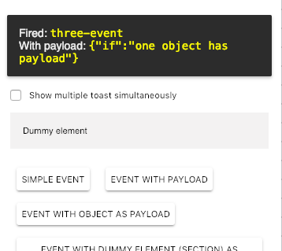

 

[Demo of component in Cells Catalog](https://catalogs.platform.bbva.com/cells)

# cells-demo-event-toaster

`<cells-demo-event-toaster>` listens to a list of events and
opens a `paper-toast` element when those events are triggered.

In case it has a payload, it will also print it.

Example:

```html
<cells-demo-event-toaster events="[[eventsArray]]"></cells-demo-event-toaster>
```

## Styling

The class `full-width` can be used to expand the toast to the full viewport width.

| Custom property                          | Description                                | Default |
|:-----------------------------------------|:-------------------------------------------|:-------:|
| --cells-demo-event-toaster               | empty mixin for :host                      | {}      |
| --cells-demo-event-toaster-highlight     | empty mixin for toaster highlighted texts  | {}      |
| --cells-demo-event-toaster-vertical-top  | margin top in vertical align top           | 160px   |

