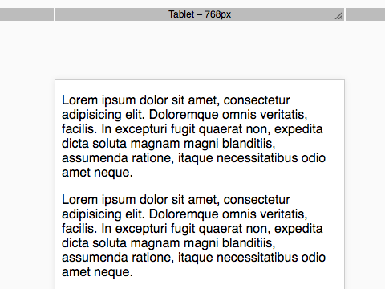

# cells-demo-resizable-viewport

[](https://catalogs.platform.bbva.com/cells) 

[Demo of component in Cells Catalog](https://catalogs.platform.bbva.com/cells)

__Example:__

```html
<cells-demo-resizable-viewport
  breakpoints='{
    "mobile": { "width": 360, "height": 640, "name": "Mobile" },
    "tablet": { "width": 768, "height": 1024, "name": "Tablet" }}'
  selected-key="tablet">
</cells-demo-resizable-viewport>
```

## Styling

The following custom properties and mixins are available for styling:

Custom property | Description | Default
:--- | :--- | :---
--cells-demo-resizable-viewport-background-color | background-color of the bar container | #f0f0f0
--cells-demo-resizable-viewport-bar | Mixin applied to each viewport bar | {}
--cells-demo-resizable-viewport-bar-hover | Mixin applied to each viewport bar on :hover | {}
--cells-demo-resizable-viewport-bar-hover-label | Mixin applied to bar label on :hover | {}
--cells-demo-resizable-viewport-bar-hover-label-siblings | Mixin applied to siblings bar labels on :hover | {}
--cells-demo-resizable-viewport-bar-hover-siblings | Mixin applied to bar siblings on :hover | {}
--cells-demo-resizable-viewport-bar-label | Mixin applied to bar labels | {}
--cells-demo-resizable-viewport-bar-selected | Mixin applied to selected bar | {}
--cells-demo-resizable-viewport-bar-selected-label | Mixin applied to selected bar label | {}
--cells-demo-resizable-viewport-bar-selected-siblings | Mixin applied to selected bar siblings | {}
--cells-demo-resizable-viewport-bar-selected-siblings-hover | Mixin applied to selected bar siblings on :hover | {}
--cells-demo-resizable-viewport-bar-wrapper | Mixin applied to bars wrapper | {}
--cells-demo-resizable-viewport-button-reset | Mixin applied to reset button | {}
--cells-demo-resizable-viewport-button-reset-active | Mixin applied to reset button for :hover, :active and :focus states | {}
--cells-demo-resizable-viewport-dragger | Mixin applied to dragger icon | {}
--cells-demo-resizable-viewport-dragger-color | Dragger icon color | #A9ABAD
--cells-demo-resizable-viewport-dragger-inactive-color | Inactive dragger icon color | #fff
