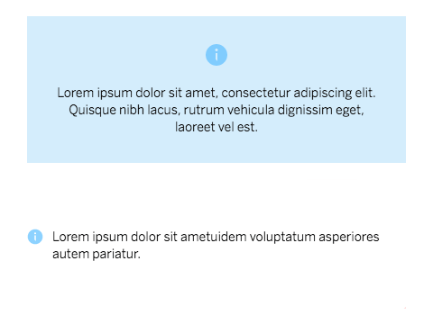

# cells-icon-message

 

[Demo of component in Cells Catalog](https://bbva-ether-cellscatalogs.appspot.com/?view=demo#/component/cells-icon-message)

`<cells-icon-message>` displays an inline informative message, such an error, warning, info or success message with an icon.
It has two different layouts. The default layout displays the icon above the text and the "inline" layout displays the icon
to the left of the text.

The `aria-label` of the icon is set automatically for three of the default valid types (info, warning and error), but you can override that value by setting the
`icon-label` attribute. If no `icon-label` is set and none of the valid types is used, the icon will not have `aria-label` as it will be considered presentational.

An image can be used instead of an icon by setting the `src` attribute. The image will be square.

Inline level HTML tags are allowed for the message. Also custom content can be used as light DOM.

__Example:__

```html
<cells-icon-message
  type="info"
  icon="coronita:info"
  message="Informative message">
</cells-icon-message>
```

__Example with custom label for the icon:__

```html
<cells-icon-message
  type="warning"
  icon-label="Important message"
  icon="coronita:alert"
  message="Lorem ipsum dolor sit amet.">
</cells-icon-message>
```

__Example with an image used as icon:__

```html
<cells-icon-message
  src="http://domain/image.png"
  message="Lorem ipsum dolor sit amet.">
</cells-icon-message>
```

__Example with format (inline level tags):__

```html
<cells-icon-message
  message="Lorem <i>ipsum</i> dolor sit amet.">
</cells-icon-message>
```

```html
<cells-icon-message
  type="info"
  icon="coronita:info"
  heading="Heading Title"
  message="Informative message">
</cells-icon-message>
```
__Example using i18n Behavior:__

```html
<cells-icon-message
  type="info"
  icon="coronita:info"
  heading="cells-icon-message-title"
  message="cells-icon-message-message">
</cells-icon-message>
```

Translation on `'locales/es.json'`

```json
{
  "cells-icon-message-title": "Hey there!",
  "cells-icon-message-message": "I am a english message, you can use i18 behavior for translation purposes."
}
```

## Icons

Since this component uses icons, it will need an [iconset](https://bbva.cellsjs.com/guides/best-practices/cells-icons.html) in your project as an [application level dependency](https://bbva.cellsjs.com/guides/advanced-guides/application-level-dependencies.html).
In fact, this component uses an iconset in its demo.

## Styling

The following custom properties and mixins are available for styling:

### Custom Properties

| Custom Property                                    | Selector                                 | CSS Property                             | Value                                                            |
| -------------------------------------------------- | ---------------------------------------- | ---------------------------------------- | ---------------------------------------------------------------- |
| --cells-icon-message-icon-margin                   | :host                                    | --icon-margin                            | 1rem                                                             |
| --cells-icon-message-header-margin                 | :host                                    | --header-margin                          | 0.5rem                                                           |
| --cells-icon-message-header-font                   | :host                                    | --header-font                            | 1rem                                                             |
| --cells-icon-message-text-align                    | :host                                    | text-align                               | center                                                           |
| --cells-fontDefault                                | :host                                    | font-family                              | sans-serif                                                       |
| --cells-text-size-icon-message                     | :host                                    | font-size                                | --cells-text-size-ml                                             |
| --cells-icon-message-color-theme                   | :host                                    | color                                    | --cells-icon-message-color                                       |
| --bbva-white-core-blue                             | :host                                    | --cells-st-button-text-color-link        |  #1464A5 |
| --bbva-white-core-blue                             | :host                                    | --cells-st-link-color                    |  #1464A5 |
| --bbva-white-core-blue                             | :host                                    | --cells-st-button-text-color-transparent |  #1464A5 |
| --cells-icon-message-background-color-info         | :host([type=info])                       | background-color                         |  #D4EDFC |
| --cells-icon-message-background-color-info-dark    | :host([type=info-dark])                  | background-color                         |  #D4EDFC |
| --cells-icon-message-background-color-warning      | :host([type=warning])                    | background-color                         | --bbva-white-gold                                                |
| --cells-icon-message-background-color-error        | :host([type=error])                      | background-color                         | --bbva-white-coral                                               |
| --cells-icon-message-background-color-success      | :host([type=success])                    | background-color                         |  #daefe0 |
| --cells-icon-message-in-page-margin-left           | :host(.in-page)                          | margin-left                              | 1rem                                                             |
| --cells-icon-message-in-page-margin-right          | :host(.in-page)                          | margin-right                             | 1rem                                                             |
| --cells-icon-message-same-padding                  | :host(.same-padding)                     | padding                                  | 2rem 1rem                                                        |
| --cells-icon-message-margin-bottom-xl              | :host(.margin-bottom-xl)                 | margin-bottom                            | 2.5625rem                                                        |
| --cells-icon-message-icon-color-theme              | .icon                                    | --iron-icon-fill-color                   | --cells-icon-message-icon-color                                  |
| --icon-margin                                      | .icon                                    | margin-bottom                            | `No fallback value`                                              |
| --icon-margin                                      | :host(.inline) .icon                     | margin-right                             | calc( / 2)                                                       |
| --cells-icon-message-icon-color-theme              | :host(.inline) .icon                     | --iron-icon-fill-color                   | --cells-icon-message-icon-color                                  |
| --cells-icon-message-icon-color-info               | :host([type=info]) .icon                 | --cells-icon-message-icon-color-theme    |  #5BBEFF |
| --bbva-light-blue                                  | :host([type=info]) .icon                 | color                                    |  #5BBEFF |
| --cells-icon-message-info-width                    | :host([type=info]) .icon                 | width                                    | 1.5rem                                                           |
| --cells-icon-message-info-height                   | :host([type=info]) .icon                 | height                                   | 1.5rem                                                           |
| --cells-icon-message-icon-color-info-dark          | :host([type=info-dark]) .icon            | --cells-icon-message-icon-color-theme    |  #072146 |
| --bbva-dark-blue                                   | :host([type=info-dark]) .icon            | color                                    |  #072146 |
| --cells-icon-message-info-dark-width               | :host([type=info-dark]) .icon            | width                                    | 1.5rem                                                           |
| --cells-icon-message-info-dark-height              | :host([type=info-dark]) .icon            | height                                   | 1.5rem                                                           |
| --cells-icon-message-icon-color-warning            | :host([type=warning]) .icon              | --cells-icon-message-icon-color-theme    | --bbva-gold                                                      |
| --cells-icon-message-warning-width                 | :host([type=warning]) .icon              | width                                    | 1.5rem                                                           |
| --cells-icon-message-warning-height                | :host([type=warning]) .icon              | height                                   | 1.5rem                                                           |
| --cells-icon-message-icon-color-error              | :host([type=error]) .icon                | --cells-icon-message-icon-color-theme    | --bbva-dark-red                                                  |
| --cells-icon-message-error-width                   | :host([type=error]) .icon                | width                                    | 1.5rem                                                           |
| --cells-icon-message-error-height                  | :host([type=error]) .icon                | height                                   | 1.5rem                                                           |
| --cells-icon-message-icon-color-success            | :host([type=success]) .icon              | --cells-icon-message-icon-color-theme    |  #48ae64 |
| --cells-icon-message-success-width                 | :host([type=success]) .icon              | width                                    | 1.5rem                                                           |
| --cells-icon-message-success-height                | :host([type=success]) .icon              | height                                   | 1.5rem                                                           |
| --strong-font-weight                               | .message strong                          | font-weight                              | `No fallback value`                                              |
| --cells-icon-message-messages-list-line-height     | .messages-list                           | line-height                              | 1.5rem                                                           |
| --cells-icon-message-messages-list-padding-top     | .messages-list                           | padding-top                              | 0                                                                |
| --header-margin                                    | .header                                  | margin-bottom                            | `No fallback value`                                              |
| --header-font                                      | .header                                  | font-size                                | `No fallback value`                                              |
| --strong-font-weight                               | .header strong                           | font-weight                              | `No fallback value`                                              |
| --cells-text-size-xs                               | :host(.help)                             | --cells-text-size-icon-message           | --cells-text-size-12                                             |
| --cells-text-size-xs                               | :host(.message-input)                    | --cells-text-size-icon-message           | --cells-text-size-12                                             |
| --bbva-200                                         | :host(.custom-message-input)             | background-color                         |  #e9e9e9 |
| --bbva-white                                       | :host(.on-dark)                          | --cells-icon-message-color-theme         |  #fff          |
| --bbva-white                                       | :host(.on-dark) .icon                    | --cells-icon-message-icon-color-theme    |  #fff          |
| --bbva-white                                       | :host(.on-dark) .message                 | --cells-icon-message-icon-color-theme    |  #fff          |
| --bbva-white                                       | :host(.on-dark) .message                 | color                                    |  #fff          |
| --cells-icon-message-margin-top-xxxxl-margin-top   | :host(.margin-top-xxxxl)                 | margin-top                               | 1.5rem                                                           |
| --cells-icon-message-flex-display                  | :host(.flex-message)                     | display                                  | inline                                                           |
| --cells-icon-message-flex-icon-margin              | :host(.flex-message) .icon               | margin                                   | -0.1rem 0.25rem 0 0                                              |
| --cells-icon-message-flex-icon-width               | :host(.flex-message) .icon               | width                                    | 1rem                                                             |
| --cells-icon-message-flex-icon-height              | :host(.flex-message) .icon               | height                                   | 1rem                                                             |
| --cells-icon-message-flex-icon-display             | :host(.flex-message) .icon               | display                                  | inline-flex                                                      |
| --cells-icon-message-slotted-p-no-paragraph-margin | :host(.no-paragraph-margin) ::slotted(p) | margin                                   | 0 0                                                              |
| --bbva-dark-medium-blue                            | :host(.dark-medium-blue-icon) .icon      | --cells-icon-message-icon-color-theme    |  #1973b8 |
| --cells-text-size-xs                               | :host(.help-message)                     | --cells-text-size-icon-message           | --cells-text-size-12                                             |
| --bbva-dark-core-blue                              | :host(.help-message) .icon               | --cells-icon-message-icon-color-theme    |  #043263 |

### @apply

| Mixins                                   | Selector                           | Value |
| ---------------------------------------- | ---------------------------------- | ----- |
| --cells-icon-message                     | :host                              | {}    |
| --cells-icon-message-info                | :host([type=info])                 | {}    |
| --cells-icon-message-info-dark           | :host([type=info-dark])            | {}    |
| --cells-icon-message-warning             | :host([type=warning])              | {}    |
| --cells-icon-message-error               | :host([type=error])                | {}    |
| --cells-icon-message-success             | :host([type=success])              | {}    |
| --cells-icon-message-inline              | :host(.inline)                     | {}    |
| --cells-icon-message-inline-info         | :host(.inline[type=info])          | {}    |
| --cells-icon-message-inline-info-dark    | :host(.inline[type=info-dark])     | {}    |
| --cells-icon-message-inline-warning      | :host(.inline[type=warning])       | {}    |
| --cells-icon-message-inline-error        | :host(.inline[type=error])         | {}    |
| --cells-icon-message-inline-success      | :host(.inline[type=success])       | {}    |
| --cells-icon-message-in-page             | :host(.in-page)                    | {}    |
| --cells-icon-message-icon                | .icon                              | {}    |
| --cells-icon-message-icon-inline         | :host(.inline) .icon               | {}    |
| --cells-icon-message-icon-info           | :host([type=info]) .icon           | {}    |
| --cells-icon-message-icon-info-dark      | :host([type=info-dark]) .icon      | {}    |
| --cells-icon-message-icon-warning        | :host([type=warning]) .icon        | {}    |
| --cells-icon-message-icon-error          | :host([type=error]) .icon          | {}    |
| --cells-icon-message-icon-success        | :host([type=success]) .icon        | {}    |
| --cells-icon-message-message             | .message                           | {}    |
| --cells-icon-message-message-strong      | .message strong                    | {}    |
| --cells-icon-message-messages-list       | .messages-list                     | {}    |
| --cells-icon-message-header              | .header                            | {}    |
| --cells-icon-message-header-strong       | .header strong                     | {}    |
| --cells-icon-message-input-icon          | :host(.help) .icon                 | {}    |
| --cells-icon-message-input-icon          | :host(.message-input) .icon        | {}    |
| --cells-icon-message-input-customized    | :host(.custom-message-input)       | {}    |
| --cells-icon-custom-message-input-icon   | :host(.custom-message-input) .icon | {}    |
| --cells-icon-message-h-gutter            | :host(.h-gutter)                   | {}    |
| --cells-icon-message-h-gutter-top-margin | :host(.h-gutter-top)               | {}    |
| --cells-icon-message-margin-top-xxxxl    | :host(.margin-top-xxxxl)           | {}    |
| --cells-icon-message-flex                | :host(.flex-message)               | {}    |
| --cells-icon-message-no-paragraph-margin | :host(.no-paragraph-margin)        | {}    |
| --cells-icon-message-help-message        | :host(.help-message)               | {}    |
| --cells-icon-message-help-message-icon   | :host(.help-message) .icon         | {}    |
