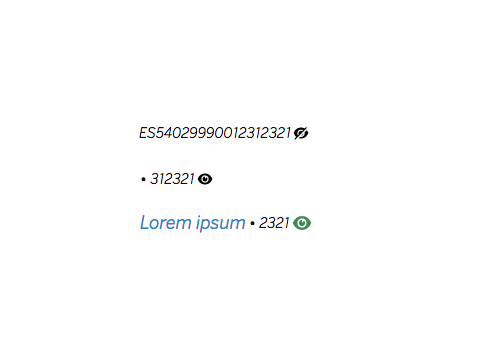

# cells-molecule-mask

 


`<cells-molecule-mask>` is a component which you pass a text value and it will be masked as 'mask-charsAAAA'
(being 'AAAA' the last four digits of the text and mask-char some custom chars, like · or \*).

You can switch between showing the masked or the whole text by clicking on the icon. You
can set the icon's size with an even number between 8 and 64 (16 by default).

Also, you can set the icon to be shown when the number is masked and the icon when it is NOT masked.

No icon will be displayed if not icon is defined.

`masked` defines if the text is masked or not.

Example:

```html
<cells-molecule-mask
  value="ES54029990012312321"
  masked
  mask-chars="•"
  icon-masked="icon-code-masked"
  icon-not-masked="icon-code-not-masked"
  icon-size="8">
</cells-molecule-mask>
```

Last 8 chars won't be masked

```html
<cells-molecule-mask
  value="ES54029990012312321"
  visible-chars="8"
  masked
  mask-chars="•"
  icon-masked="icon-code-masked"
  icon-not-masked="icon-code-not-masked"
  icon-size="8">
</cells-molecule-mask>
```

Initially not masked

```html
<cells-molecule-mask
  number="ES54029990012312321"
  mask-chars="•••"
  icon-masked="icon-code-masked"
  icon-not-masked="icon-code-not-masked">
</cells-molecule-mask>
```

## Icons

Since this component uses icons, it will need an [iconset](https://bbva.cellsjs.com/guides/best-practices/cells-icons.html) in your project as an [application level dependency](https://bbva.cellsjs.com/guides/advanced-guides/application-level-dependencies.html). In fact, this component uses an iconset in its demo.

## Styling

The following custom properties and mixins are available for styling:

### Custom Properties
| Custom Property                           | Selector     | CSS Property  | Value        |
| ----------------------------------------- | ------------ | ------------- | ------------ |
| --cells-molecule-mask-margin-right        | ::slotted(*) | padding-right | 0.1875rem    |
| --cells-molecule-mask-margin-right        | .mask        | margin-right  | 0.1875rem    |
| --cells-molecule-mask-separator-font-size | .mask        | font-size     | 1rem         |
| --cells-molecule-mask-icon-color          | .icon        | color         | currentColor |
| --cells-molecule-mask-number-font-size    | .number      | font-size     | inherit      |
### @apply
| Mixins                            | Selector         | Value |
| --------------------------------- | ---------------- | ----- |
| --cells-molecule-mask             | :host            | {}    |
| --cells-molecule-mask-wrapper     | .wrapper         | {}    |
| --cells-molecule-mask-content     | .content         | {}    |
| --cells-molecule-mask-separator   | .mask            | {}    |
| --cells-molecule-mask-number      | .number          | {}    |
| --cells-molecule-mask-icon-button | .btn-transparent | {}    |
